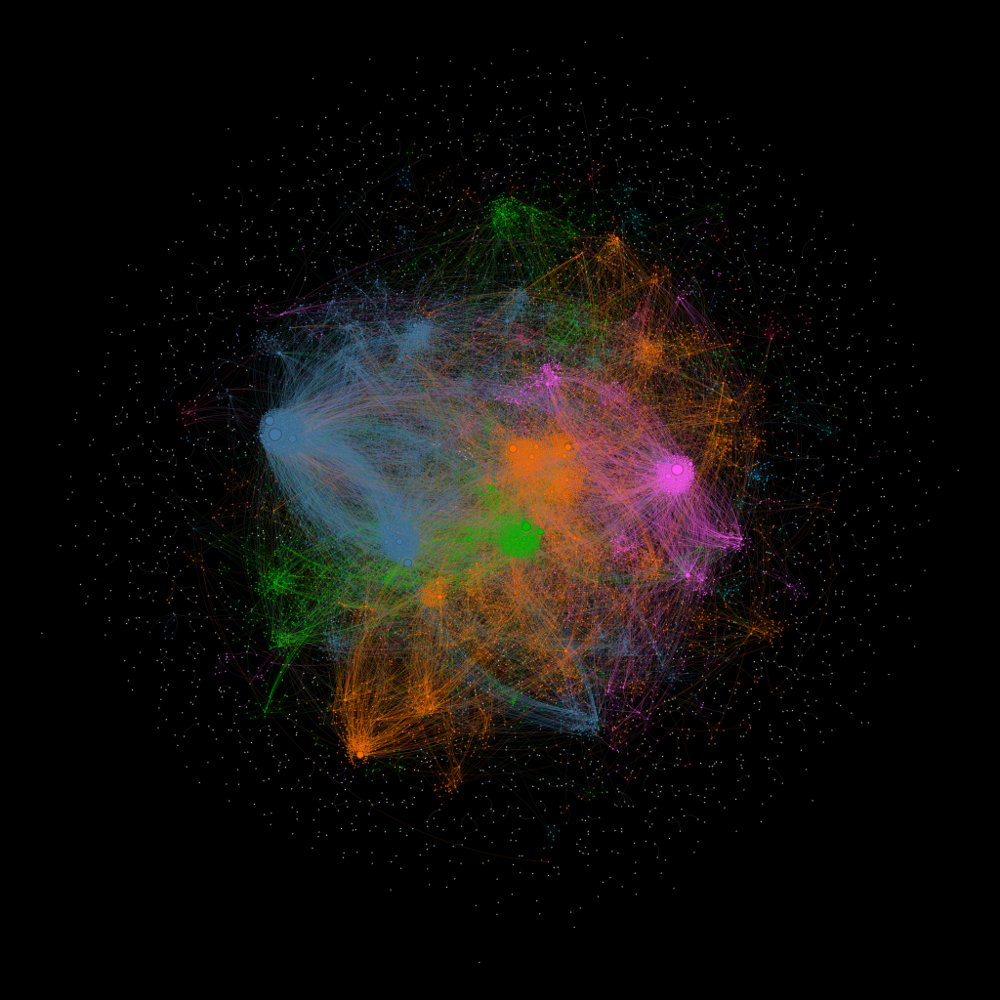
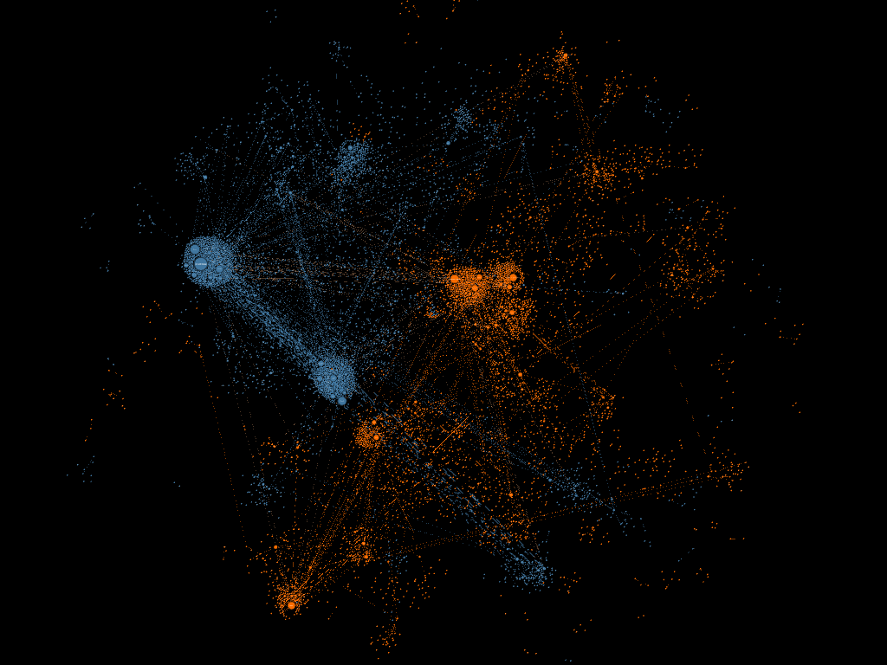
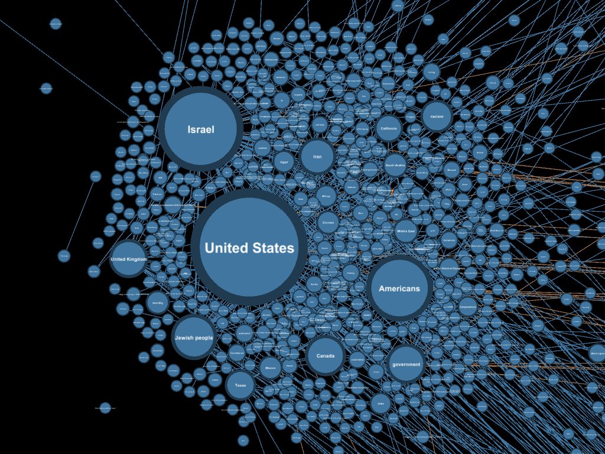
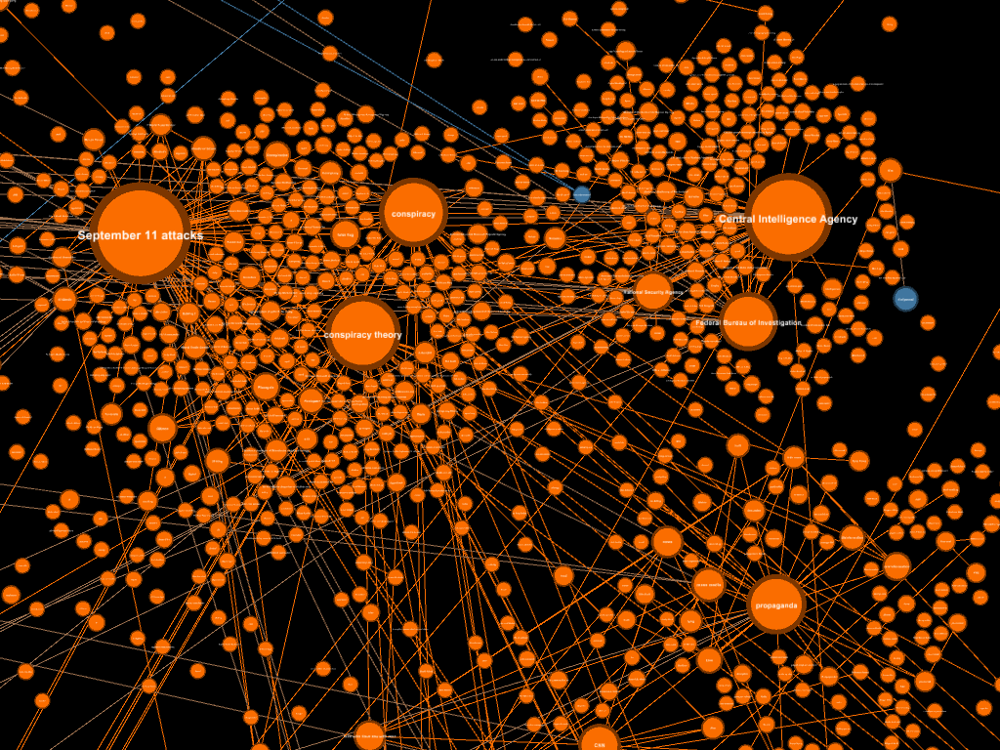

# conspiracy-graph


## Repository Contents

- `data/`: Stores all project data. Many directories contain very large files. To keep the repository manageable, the directories are included with a `.gitkeep` file, while the actual data files are listed in `.gitignore`.  
  - `data_models/`: JSON files representing individual lines from the raw compressed `.zst` files and the corresponding Wikidata response format.  
  - `extracted_data/`: Data extracted from the raw files, including creation timestamps, original post links, post content, etc.  
  - `filtered_entities/`: Filtered entities for the knowledge graph.  
  - `knowledge_graph/`: Final data used for visualizing the knowledge graph.  
  - `prepped_data/`: Cleaned and preprocessed data for input into the transformer model (e.g., with AutoModerator comments removed and short posts filtered out).  
  - `raw_data/`: Original compressed files downloaded from [The-Eye: Reddit Archive](https://the-eye.eu/redarcs/).  
  - `raw_entities/`: Outputs from the transformer model containing extracted entities and relationships used to build the knowledge graph.  

- `scripts/`: Python scripts for transforming data and generating the knowledge graph.  
  - `build_knowledge_graph/`: Scripts for building the graph from filtered entities.  
  - `extract_data/`: Scripts for extracting raw Reddit data into readable formats.  
  - `extract_entities/`: Scripts for extracting entities and relationships for the knowledge graph.  
  - `filter_entities/`: Scripts for filtering raw knowledge graph entities and performing entity linking.  
  - `prep_data/`: Scripts for preparing data for entity and relationship extraction.  
  - `utility/`: Helper scripts for utility functions, such as GPU validation and querying Wikidata.  

## Replication: Creating the Knowledge Graphs

The code in this repository can be used to regenerate the knowledge graphs or adapted to build similar graphs for other subreddits. The steps are outlined below:

### Step 1: Python Environment Setup

This project was developed using **Python 3.12.6**. Other versions may cause compatibility issues, particularly with PyTorch and other dependencies. Packages and dependencies are managed with [uv](https://docs.astral.sh/uv/), and this guide assumes `uv` is installed.
1. Initialize uv: ```uv init```
2. Create the python environment: ```uv venv .venv```
3. Activate the environment:
	- Linux/macOS: ```source .venv/bin/activate```
	- Windows: ```.venv\Scripts\activate```
4. Install packages from the lock file: ```uv sync```
5. Deactivate the environment when done: `deactivate`


### (Optional) GPU Setup for PyTorch

If you plan to use a GPU, follow the [PyTorch docs](https://pytorch.org/get-started/locally/) for the appropriate CUDA version. Example steps:

- Uninstall existing PyTorch packages: `pip uninstall torch torchvision torchaudio`
- Install PyTorch with CUDA libraries (example for CUDA 11.8): `pip3 install torch torchvision torchaudio --index-url https://download.pytorch.org/whl/cu118`
- Validate PyTorch and GPU setup: `uv run ./scripts/utility/gpu_validation.py`

### Step 2: Sourcing the data
Archived reddit post and comment data was pulled from [The-Eye: Reddit Archive](https://the-eye.eu/redarcs/). The following files were manually downloaded to the `data/raw_data/` directory. As mentioned above, some of the data was not uploaded to Github due to the sheer size of files.

#### r/conspiracy
- Posts: https://the-eye.eu/redarcs/files/conspiracy_submissions.zst
- Comments: https://the-eye.eu/redarcs/files/conspiracy_comments.zst

#### r/conspiracytheories
- Posts: https://the-eye.eu/redarcs/files/conspiracytheories_submissions.zst
- Comments: https://the-eye.eu/redarcs/files/conspiracytheories_comments.zst

#### r/conspiracy_commons
- Posts: https://the-eye.eu/redarcs/files/conspiracy_commons_submissions.zst
- Comments: https://the-eye.eu/redarcs/files/conspiracy_commons_comments.zst

#### r/conspiracyII
- Posts: https://the-eye.eu/redarcs/files/ConspiracyII_submissions.zst
- Comments: https://the-eye.eu/redarcs/files/ConspiracyII_comments.zst

### Step 3: Extracting Relevant Data
**Command:** `uv run ./scripts/extract_data/extract_data.py`

Decompresses `.zst` Reddit archives using the `zstandard` library and converts them to structured `.jsonl` files. Data is read in chunks to handle UTF-8 boundary issues, and each line is parsed as a JSON object. Malformed lines are logged but do not interrupt processing. Output fields and key mappings are configurable via `extract_data_config.json`. Processed files are written to `data/extracted_data/`, preserving the original directory structure.

### Step 4: Prepping Model Data
**Command:** `uv run ./scripts/prepped_data/prep_data.py`

Filters the extracted dataset to remove content unsuitable for model input: AutoModerator comments, posts below minimum length thresholds, and deleted or removed entries. A pre-trained spaCy NER model is applied to exclude posts containing no named entities. Valid lines are batched and written to `data/prepped_data/`. Filtering criteria are configurable via `prep_data_config.json`.

### Step 5: Extracting the Entities
**Command:** `uv run ./scripts/extract_entities/extract_entities.py`

Runs Babelscape's REBEL Large model over the preprocessed `.jsonl` files to extract subject-relation-object triplets. Inputs are tokenized and batched for efficiency, with beam search applied to improve output quality. GPU acceleration is used automatically when available. Processing state is tracked via a JSON configuration file, allowing safe interruption and resumption. Extracted triplets are written to `data/raw_entities/`.

### Step 6: Filtering the Entities
**Command:** `uv run ./scripts/filter_entities/filter_entities.py`

Links raw extracted entities to Wikidata to filter low-quality or semantically uninformative triplets. For each head and tail entity, candidate Wikidata labels and aliases are scored using Levenshtein similarity. Only candidates above a defined threshold are retained. Triplets where either entity cannot be confidently linked are discarded. Output is written to `data/filtered_entities/`. Processing state is tracked for safe interruption and resumption.

### Step 7: Building the Knowledge Graph
**Command:** `uv run ./scripts/build_knowledge_graph/build_graph_data.py`

Ingests filtered triplets and constructs two knowledge graphs. Duplicate edges are aggregated into raw co-occurrence counts, self-loops are discarded, and edges are treated as undirected. Raw counts are normalized to a 0–1 range. A configurable percentile threshold is then applied to remove weak edges, followed by renormalization of the remaining values. The first graph retains more edges for high-resolution visualization. The second applies a stricter threshold for use in Gephi. Both graphs, along with raw edge counts, are exported to the output directory. The Gephi-compatible export includes separate CSV files for nodes and edges.

### Step 8: Analysis

Analysis was performed in [Gephi](https://gephi.org/). Python packages such as NetworkX are suitable alternatives for programmatic graph analysis. A few visuals of the graph rendered by Gephi are shown below.





